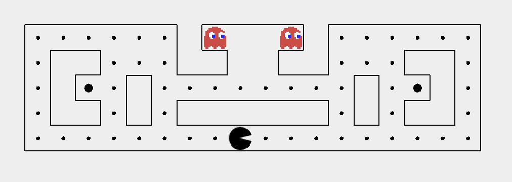

# Pacman
This project implements the classic game Pac-Man using Java

## Overview
Pacman is a maze chase game developed in 1980s
- The player controls the eponymous character through an enclosed maze. 
- The objective of the game is to eat all of the dots placed in the maze while avoiding
 four colored ghosts that pursue him.
 
This application also supports: 
- Customized maze
- Customized difficulties and behavior for each Pacman/Ghost
- Play as Pacman/Ghost
- Play with multiple players at the same time
 
## Tech Stack and Java Technologies Involved
- Basic Java 
    -  Data structures  and file IO 
    - Swing as GUI interface
    - P2P and centralized network (sockets)
    - Multi-threading
- Java Programming Skills
    - BFS/DFS/A-star algorithm
    - Data synchronization through network
    - Functional programming, lambda and currying
- Object Oriented Programming
    - SOLID principle
    - Inheritance and polymorphism
    - Design patterns
        - Model-View-Controller
        - Factory pattern 
        - Static factory methods
        - Interning pattern
        - Command pattern

## Documentation
- User manual is located under `docs/`
- Javadocs are located under `docs/javadoc`
- Installation and deployment guide and other related information are located under `docs/readme.txt`
- Installation scripts are under `scripts/`

## Future Development 
- Improve AI algorithms
- Add encryption on networking datagrams
- Redesign UI
- Optimization
    

